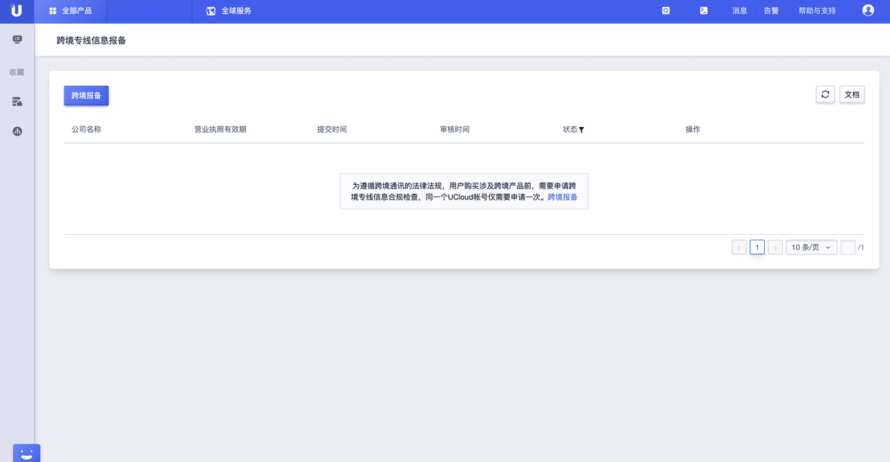
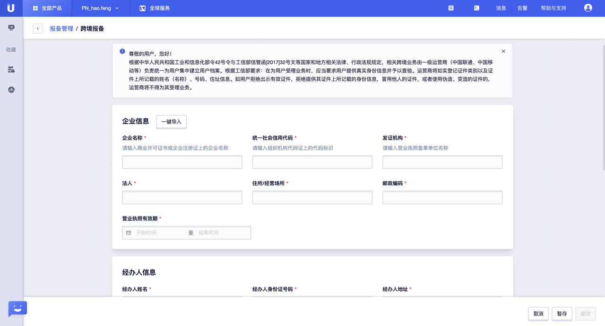

<!--一下子提供一种思路，欢迎大家发挥 -->

# 跨境专线合规检查

## 产品简介

《跨境专线信息报备》是为了满足法律法规和监管要求，针对购买或者使用跨境产品、服务、线路资源的客户提供相关信息报备和审核的信息管理系统；


## 使用场景

客户或者用户需要购买或者使用跨境产品、服务、线路资源，需要先进行相关信息的报备操作；


## 操作步骤

第一步：在控制台上，依次点击【全部产品】--【企业应用】--【跨境专线信息报备】，即可进入跨境专线信息报备管理界面；




第二步：点击【跨境报备】按钮，在弹出界面上按照提示，输入、上传相关信息和资料，【提交】即可；



```
①若客户/用户过往在UCloud上进行过网站报备或者其他产品、形式的报备操作，可通过【一键导入】授权系统获取相关信息
用于跨境报备；
②请确保报备信息的完整性和准确性，并符合界面提示规范，否则会影响审核结果。
```


第三步：系统将在2-3个工作日完成报备信息的审核操作，审核通过后，即可正常购买/使用跨境产品、服务、线路资源；


## FAQ

1、一个公司ID只需要报备一次，即可多次购买或者使用多个地域之间的跨境产品、服务、线路资源；

2、报备信息过期或者更新期间，不会影响到业务的正常运行；


## 常见问题

1、跨境报备信息的审核是由UCloud来进行的吗？

A：UCloud只负责用户上传信息的真实和合规性，业务层面的审核由提供对应资源的基础运营商审核；

2、跨境报备审核周期是多久？

A：客户/用户提交报备信息后，2-3个工作日即可完成审核操作；
